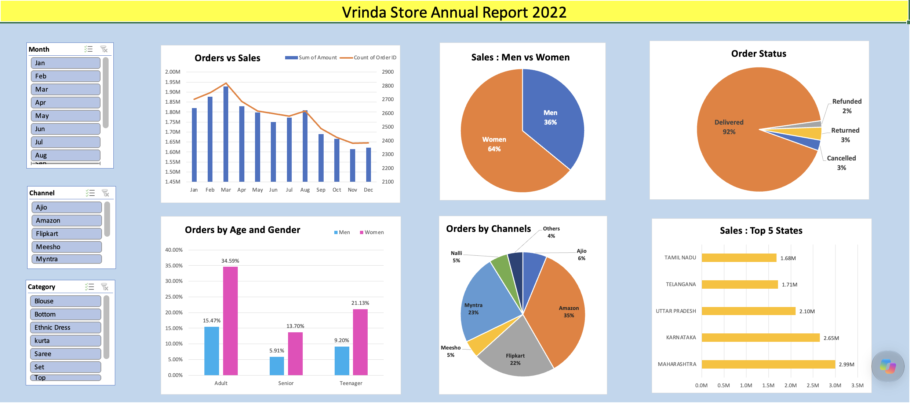

# Vrinda Store Sales Analysis

## Project Overview

An Excel-based sales analysis and interactive dashboard for Vrinda Store. The project analyzes sales and order data to understand customer demographics, sales trends, order status, geographical performance, and sales channels.

## Tools Used

- Microsoft Excel
- PivotTables
- PivotCharts
- Slicers
- Data Cleaning
- Data Analysis

## Business Questions Answered

- How do sales and orders vary across different months?
- Which gender contributes more to the sales/orders?
- What is the distribution of orders by order status?
- Which states contribute the most to overall sales?
- Which customer age group contributes the most?
- Which sales channels contribute the most to orders?

## Analysis Performed

- Monthly sales and order analysis
- Gender-wise sales/order analysis
- Order status analysis
- State-wise sales analysis
- Age-group analysis
- Sales channel analysis
- Interactive dashboard using PivotTables, PivotCharts, filters, and slicers

## Key Insights

- Women contribute approximately 65% of the purchases compared to men.
- Maharashtra, Karnataka, and Uttar Pradesh are the top three contributing states, accounting for approximately 35% of the overall contribution.
- The adult age group (30–49 years) contributes approximately 50% of the purchases.
- Amazon, Flipkart, and Myntra are the major sales channels, contributing approximately 80% of the orders.

## Dashboard

The interactive Excel dashboard provides a consolidated view of sales performance and customer/order patterns using charts, PivotTables, filters, and slicers.

## Conclusion

The analysis indicates that women customers aged 30–49 years form a major customer segment, while Maharashtra, Karnataka, and Uttar Pradesh are among the leading contributing states. Amazon, Flipkart, and Myntra are the major sales channels identified in the analysis.
